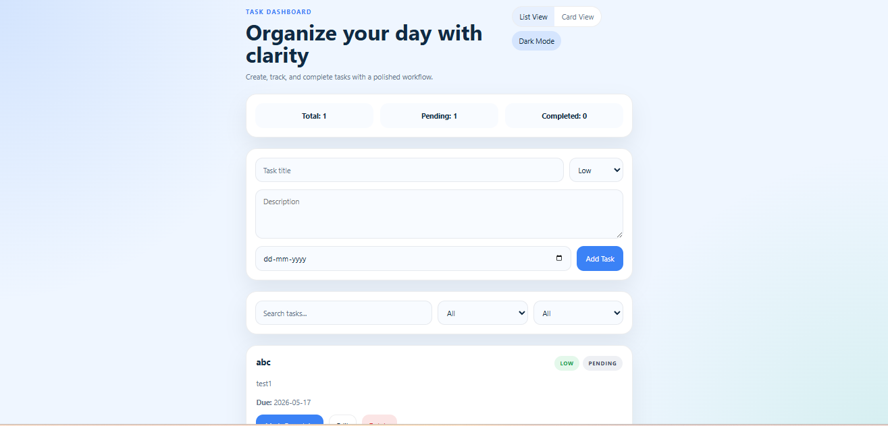
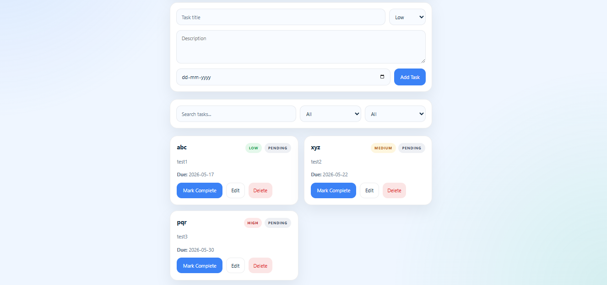

# Task Management Dashboard

A responsive Task Management Dashboard built using React.js and TypeScript. The application allows users to create, manage, edit, delete, search, and track tasks efficiently with persistent local storage support.

---

## Live Demo

https://task-management-dashboard-ashen.vercel.app/

---

## GitHub Repository

https://github.com/affan110/task-management-dashboard

---

## Features

- Create tasks with:
  - Title
  - Description
  - Priority
  - Due Date

- Edit existing tasks
- Delete tasks with confirmation
- Mark tasks as completed or pending
- Search tasks by title or description
- Filter tasks by:
  - Status
  - Priority
- Task statistics dashboard
- Local storage persistence
- Responsive design
- List / Card view toggle

---

## Tech Stack

- React.js
- TypeScript
- Vite
- CSS

---

## Setup Instructions

### Clone the Repository

```bash
git clone https://github.com/affan110/task-management-dashboard.git
```

### Navigate to Project Directory

```bash
cd task-management-dashboard
```

### Install Dependencies

```bash
npm install
```

### Run Development Server

```bash
npm run dev
```

### Build for Production

```bash
npm run build
```

---

## Design Decisions

- Used React functional components with hooks for state management
- Used TypeScript for improved type safety and maintainability
- Used localStorage for persistent task storage
- Designed reusable and modular UI components
- Implemented responsive layout using Flexbox and media queries
- Added clean UI structure with task badges and status indicators

---

## Screenshots

### Application Preview

<p align="center">
  
</p>

<p align="center">
  
</p>
---

## Author

Abu Affan Ansari  
M.Tech CSE, NIT Rourkela
